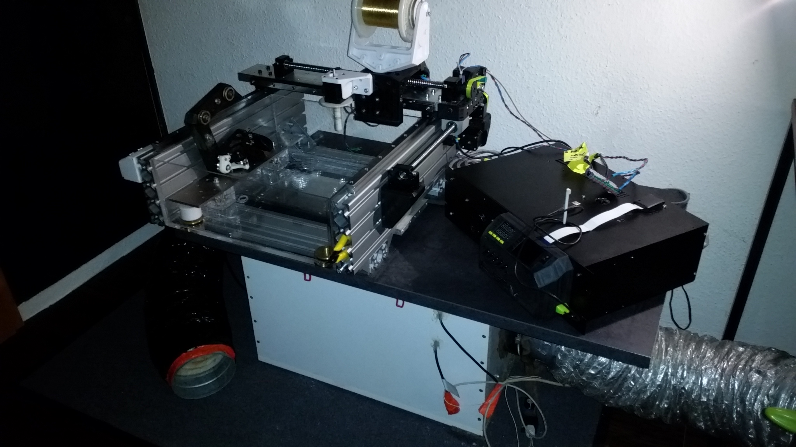
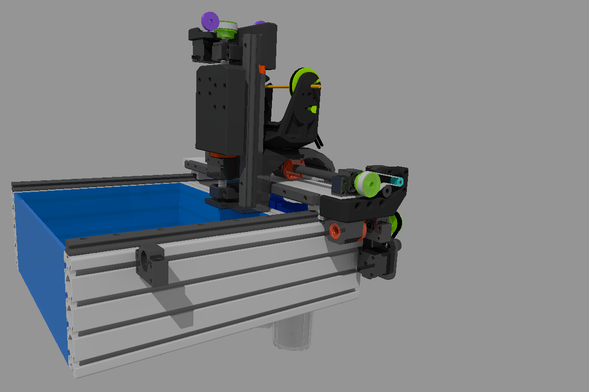
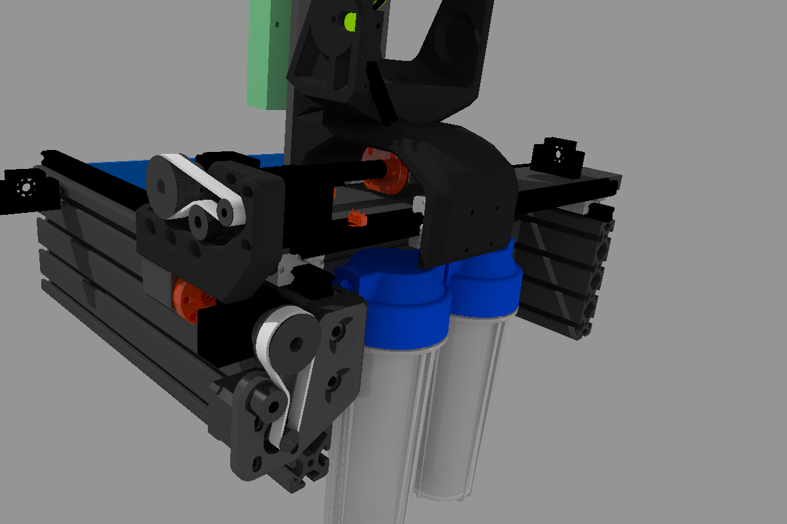

# GEDM-EVO2-CNC
Gantry based 3 axis CNC router with heavy duty 3d printed parts


```diff
  ______         ________ _______  __       __      ________ __     __  ______       ______ ______ 
 /      \       |        \       \|  \     /  \    |        \  \   |  \/      \     |      \      \
|  ▓▓▓▓▓▓\      | ▓▓▓▓▓▓▓▓ ▓▓▓▓▓▓▓\ ▓▓\   /  ▓▓    | ▓▓▓▓▓▓▓▓ ▓▓   | ▓▓  ▓▓▓▓▓▓\     \▓▓▓▓▓▓\▓▓▓▓▓▓
| ▓▓ __\▓▓______| ▓▓__   | ▓▓  | ▓▓ ▓▓▓\ /  ▓▓▓    | ▓▓__   | ▓▓   | ▓▓ ▓▓  | ▓▓      | ▓▓   | ▓▓  
| ▓▓|    \      \ ▓▓  \  | ▓▓  | ▓▓ ▓▓▓▓\  ▓▓▓▓    | ▓▓  \   \▓▓\ /  ▓▓ ▓▓  | ▓▓      | ▓▓   | ▓▓  
| ▓▓ \▓▓▓▓\▓▓▓▓▓▓ ▓▓▓▓▓  | ▓▓  | ▓▓ ▓▓\▓▓ ▓▓ ▓▓    | ▓▓▓▓▓    \▓▓\  ▓▓| ▓▓  | ▓▓      | ▓▓   | ▓▓  
| ▓▓__| ▓▓      | ▓▓_____| ▓▓__/ ▓▓ ▓▓ \▓▓▓| ▓▓    | ▓▓_____   \▓▓ ▓▓ | ▓▓__/ ▓▓     _| ▓▓_ _| ▓▓_ 
 \▓▓    ▓▓      | ▓▓     \ ▓▓    ▓▓ ▓▓  \▓ | ▓▓    | ▓▓     \   \▓▓▓   \▓▓    ▓▓    |   ▓▓ \   ▓▓ \
  \▓▓▓▓▓▓        \▓▓▓▓▓▓▓▓\▓▓▓▓▓▓▓ \▓▓      \▓▓     \▓▓▓▓▓▓▓▓    \▓     \▓▓▓▓▓▓      \▓▓▓▓▓▓\▓▓▓▓▓▓
```


# Responsible for the content provided
    Lautensack Roland (Germany)
    Contact: goblin-dev@proton.me


# This project is still a work in progress and not fully finished yet

The GEDM-EVO2 Gantry Router uses heavy duty 3D printed parts, strong HGR20 linear rails, ballscrews and heavy profiles (40x160).

With only a few upgrades/changes it will be able to not only do EDM but also mill wood and smaller aluminum parts.

In order to do those milling jobs it may require a second ballscrew on the left side.

The wire extension used in the images is the one designed by Alex Treseder for the PicoEDM:
https://github.com/alextreseder/picoEDM

Not fully finished. Z axis is still missing and the massive aluminum plate on the front is temporary.
[](https://youtu.be/4GycnoLOGnc)








# Legal notes

    The author of this project is in no way responsible for whatever people do with it.

    No warranty. 


# License

    All files provided are for private use only if not declared otherwise and any form of commercial use or redistribution of the protected files is prohibited. 
    


    
    
# Follow the project:

[>>> Follow the project on Youtube <<<](https://www.youtube.com/@G-EDM/videos)

[>>> Stay informed on Hackaday <<<](https://hackaday.io/project/190371-g-edm)

[>>> Get involved on Discord <<<](https://discord.gg/9cTsyDkEbe)


# Donations

    * Developement is not always as fast as it could be if you're poor. You want to donate something? 
    * Paypal: paypal.me/gedmdev
    * Bitcoin: bc1q9akp00a5hceh9n3jc9wfttxuwuk9c7da0sqkr8
    


