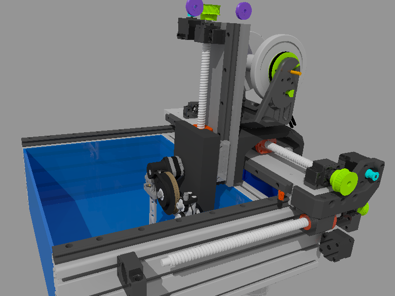
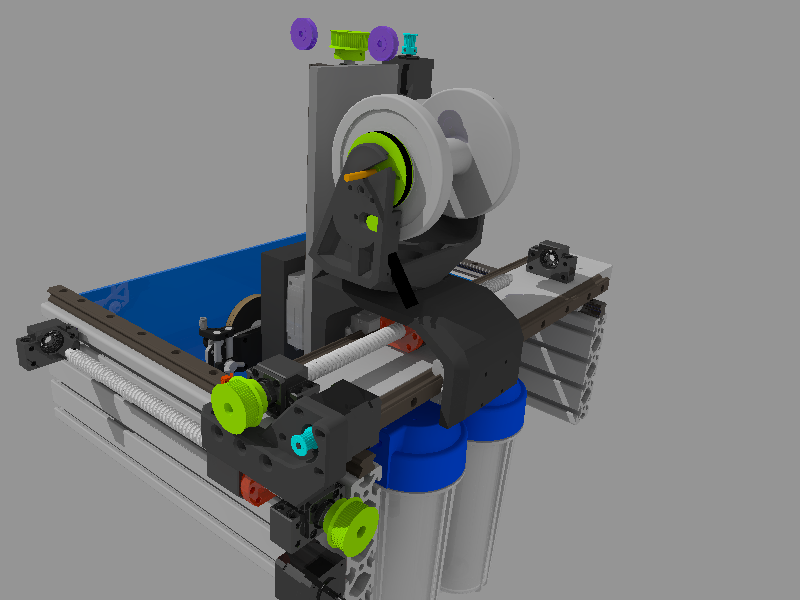
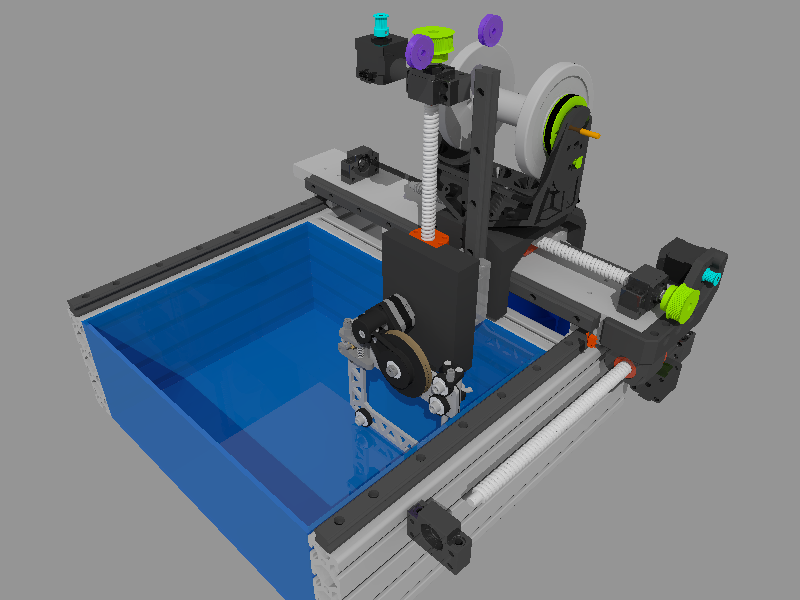
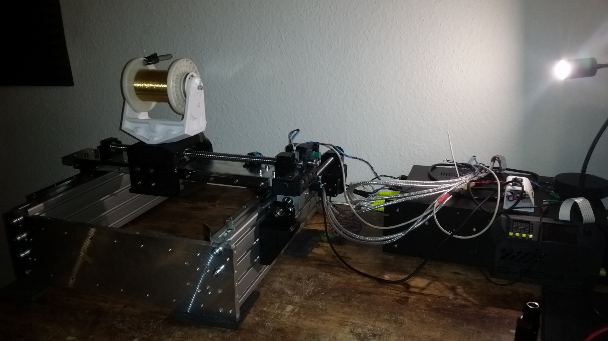

# GEDM-EVO2-CNC
Gantry based 3 axis CNC router with heavy duty 3d printed parts


```diff
  ______         ________ _______  __       __      ________ __     __  ______       ______ ______ 
 /      \       |        \       \|  \     /  \    |        \  \   |  \/      \     |      \      \
|  ▓▓▓▓▓▓\      | ▓▓▓▓▓▓▓▓ ▓▓▓▓▓▓▓\ ▓▓\   /  ▓▓    | ▓▓▓▓▓▓▓▓ ▓▓   | ▓▓  ▓▓▓▓▓▓\     \▓▓▓▓▓▓\▓▓▓▓▓▓
| ▓▓ __\▓▓______| ▓▓__   | ▓▓  | ▓▓ ▓▓▓\ /  ▓▓▓    | ▓▓__   | ▓▓   | ▓▓ ▓▓  | ▓▓      | ▓▓   | ▓▓  
| ▓▓|    \      \ ▓▓  \  | ▓▓  | ▓▓ ▓▓▓▓\  ▓▓▓▓    | ▓▓  \   \▓▓\ /  ▓▓ ▓▓  | ▓▓      | ▓▓   | ▓▓  
| ▓▓ \▓▓▓▓\▓▓▓▓▓▓ ▓▓▓▓▓  | ▓▓  | ▓▓ ▓▓\▓▓ ▓▓ ▓▓    | ▓▓▓▓▓    \▓▓\  ▓▓| ▓▓  | ▓▓      | ▓▓   | ▓▓  
| ▓▓__| ▓▓      | ▓▓_____| ▓▓__/ ▓▓ ▓▓ \▓▓▓| ▓▓    | ▓▓_____   \▓▓ ▓▓ | ▓▓__/ ▓▓     _| ▓▓_ _| ▓▓_ 
 \▓▓    ▓▓      | ▓▓     \ ▓▓    ▓▓ ▓▓  \▓ | ▓▓    | ▓▓     \   \▓▓▓   \▓▓    ▓▓    |   ▓▓ \   ▓▓ \
  \▓▓▓▓▓▓        \▓▓▓▓▓▓▓▓\▓▓▓▓▓▓▓ \▓▓      \▓▓     \▓▓▓▓▓▓▓▓    \▓     \▓▓▓▓▓▓      \▓▓▓▓▓▓\▓▓▓▓▓▓
```


# This project is still a work in progress and not fully finished yet

The GEDM-EVO2 Router uses heavy duty 3D printed parts, strong HGR20 linear rails, ballscrews and heavy profiles.

The design is build around the multiuse concept. With only a few upgrades/changes it will be able to not only do EDM but also mill wood and smaller aluminum parts.

In order to do those milling jobs it may require a second ballscrew on the left side.








Not fully finished:



